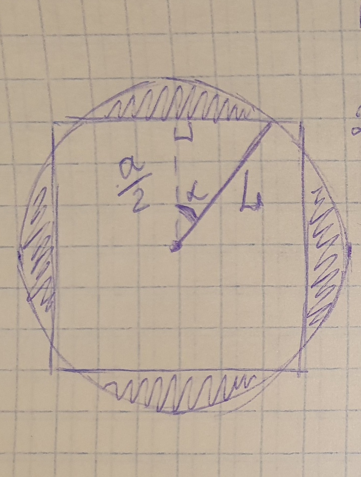

## Условие
**Входные данные:** `a` - сторона квадрата травы, `l` - длина верёвки, на которую в центре квадрата привязан козёл

**Выходные данные:** площадь травы, которую съест козёл. Козёл съедает всё, до чего дотягивается, но всегда остаётся в пределах квадрата

## Решение
Понятно, что возможны три случая. Рассмотрим каждый из них.

### 1 случай: `l <= a/2`
Это значит, что круг (здесь и далее так будем обозначать всю траву, которую может съесть козёл) полность вписан в квадрат, в том числе касается его сторон.

Тогда площадь круга и будет ответом.
```
if (l <= a/2)
    answer = pi*l*l; // 
```

### 2 случай: `l >= d/2` (`d` - диагональ)
Это значит, что квадрат вписан или лежит внутри круга, то есть козёл съест всю траву на поле и ответом будет площадь квадрата.
Т.к. мы работаем с `double`, лучше считать квадраты, чем извлекать корни. Поэтому условие будет выглядеть так:
```
// 2*a*a*4 = диагональ квадрата со стороной a/2
else if (l*l >= 2*a*a/4) { 
    answer = a*a;
}
```

### 3 случай: `l` между `a/2` и `d/2`
Тогда круг будет частично лежать внутри квадрата, а вне его останутся 4 одиннаковых сегмента. Ответом будет `площадь круга - площадь сегмента * 4`. Как подсчитать площадь сегмента?

Нарисуем это:



Отсюда понятно, что:
1. `cos halfA = a/(2*l)` - из прямоугольного треугольника
2. `cos A = 2*halfA*halfA - 1` - по формуле двойного угла
3. `A = acos(cos_full)` - берём `acrcos`
4. `seg = 0.5*l*l*(A - sin(A))` - по формуле площади сегмента (окей, гугл, и будет вам счастье)

Заметим также, что мы нигде не приводим угол к градусам, а работаем в радианах (все тригонометрические функции в C++ принимают и возвращают значение в радианах)

Так получаем `answer = pi*l*l - seg*4`

## Полный код
```
cin >> a >> l;

double pi = 2*acos(0.0);
double ans = 0;

if (l <= a/2) {
    ans = pi*l*l;
}
else if (l*l >= 2*a*a/4) {
    ans = a*a;
}
else {
    double cos_half = a/(2*l);
    double cos_full = 2*cos_half*cos_half - 1;
    double phi = acos(cos_full);
    double seg = 0.5*l*l*(phi - sin(phi));
    ans = pi*l*l - seg*4;
}

cout << "Съедено " << ans;      
```
